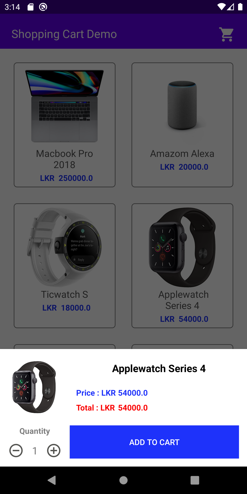
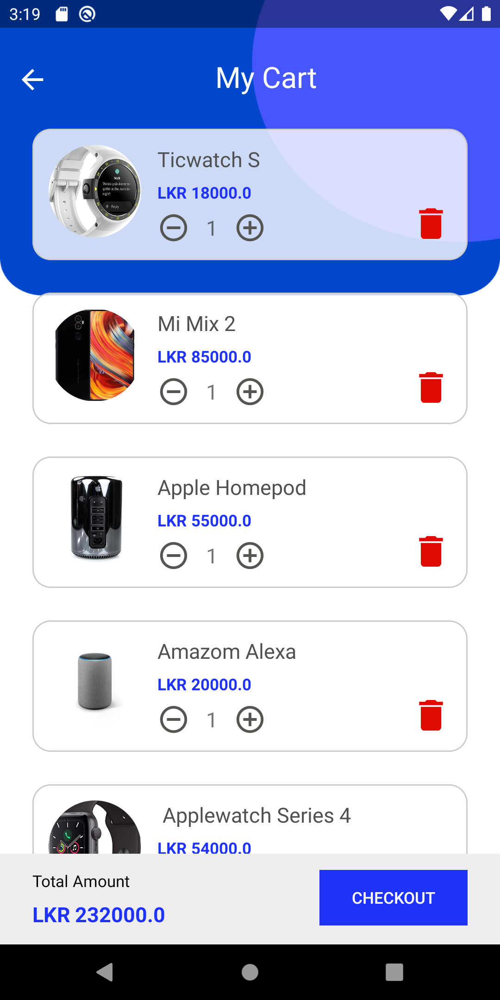

# TinyCart
[](https://jitpack.io/#hishd/TinyCart)


<table>
  <tr>
    <td>  </td>
    <td>  </td>
    <td>  </td>
  </tr>
</table>

An android library which will come in handy for e-Commerce based android applications.
The library can be used to maintain a cart for all the purchased items in a particular scenario.

# Features

  - Adding new Items to the cart
  - Retrieving Items along with quantity
  - Update the Items in the cart
  - Get total price and quantity
  - Remove Items inside the cart
  - Caustom handled exceptions

### Installation

Add the repository to your project **build.gradle**

```Gradle
allprojects {
    repositories {
        google()
        jcenter()
        maven { url 'https://jitpack.io' }
    }
}
```

And add the library to your module **build.gradle**:
```Gradle
dependencies {
    implementation 'com.github.hishd:TinyCart:1.0.1'
}
```

### Usage

After installing you must implement your Product class with using the interface **Item**
ex:
```
public class ProductItem implements Item, Serializable {
    /////
}
```

After implementing the class the Cart can be initialized and used anywhere in your application
ex:
```
Cart cart = TinyCartHelper.getCart();
```

Usages of the methods.

| Method Name | Operation |
| ------ | ------ |
| addItem(Item item, int quantity) | Add a new item to the cart|
| updateItem(final Item item, final int quantity) | Update an existing item quantity the the cart |
| removeItemQty(final Item item, final int quantity) | Removes quantity of a certain item |
| removeItem(final Item item) | Removes an item in the cart |
| clearCart() | Removes all the products and clear the cart |
| isCartEmpty() | Checks and returns true if the cart is empty|
| int getItemQty(final Item item) | Retrieves the quantity of a particular item |
| getTotalPrice() | Retrieve the total price of the cart |
| getItemNames() | Retrieves all the Items |
| getAllItemsWithQty() | Retrieves all the items in the cart along with their quantity as Map |
| toString() | Returns a concatenated string which contains the cart information |


### Exceptions

**ProductNotFoundException()** will throw while the requested product is not th the cart.
**QuantityInvalidException()** will throw when the provided quantity is not valid

**Please Refer the Sample project for more information.**
